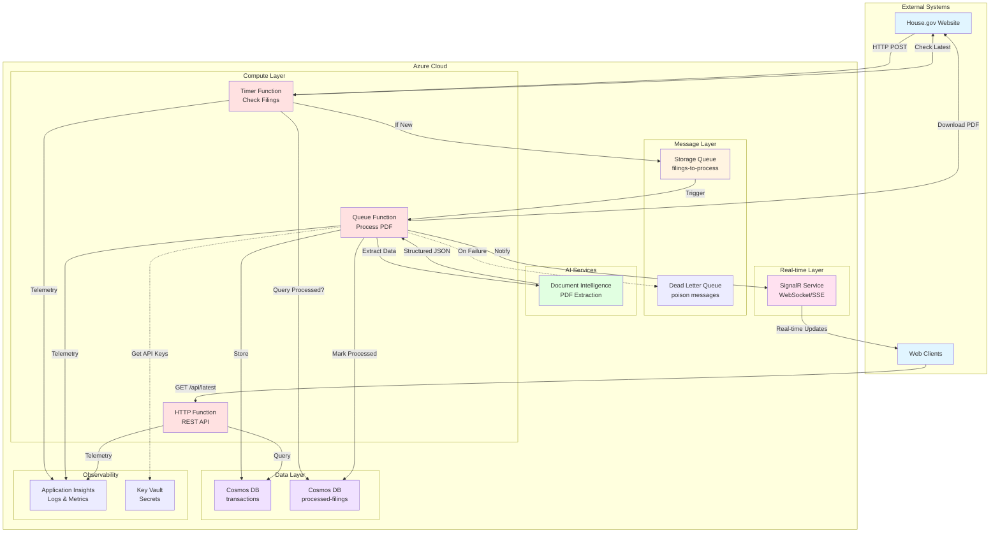
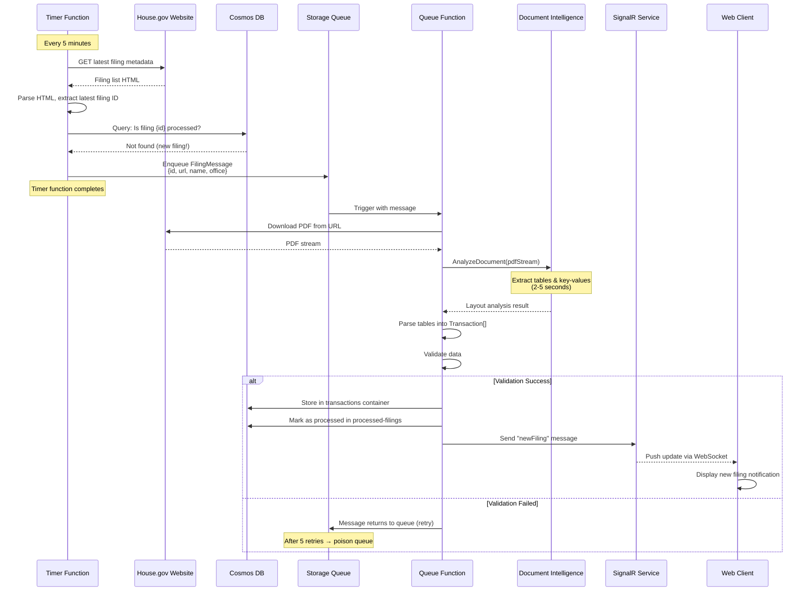
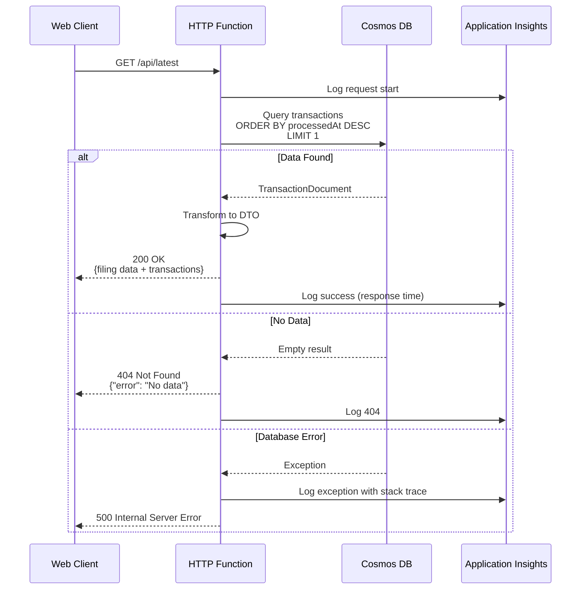
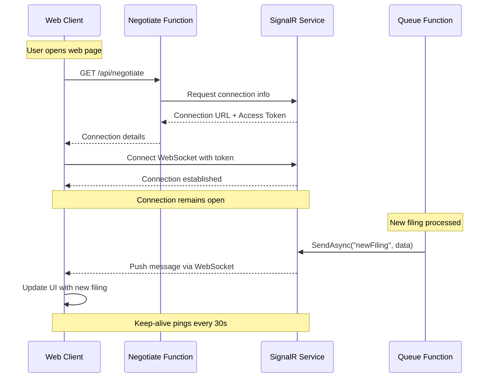
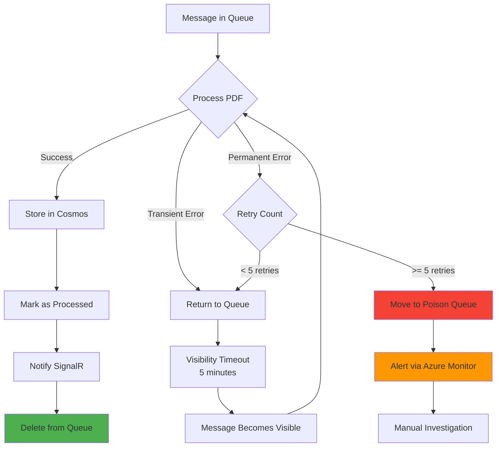
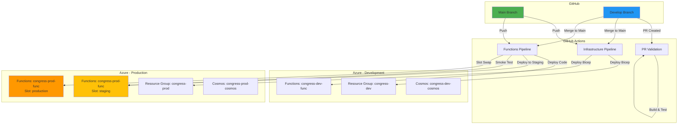
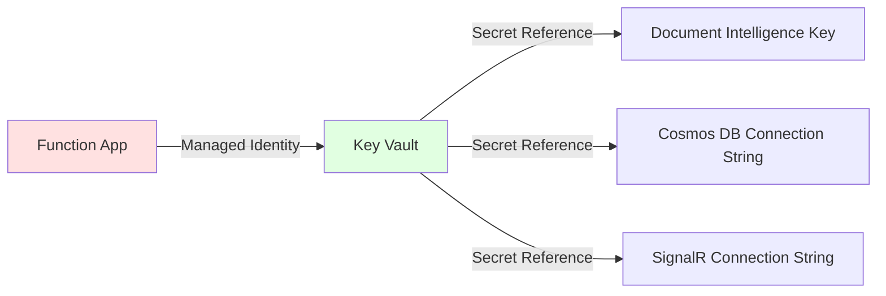

# Congress Stock Trading Tracker - System Architecture

## Table of Contents
1. [Architecture Overview](#architecture-overview)
2. [System Diagrams](#system-diagrams)
3. [Component Details](#component-details)
4. [Data Flow](#data-flow)
5. [Technology Stack](#technology-stack)
6. [Security Architecture](#security-architecture)

---

## 1. Architecture Overview

### 1.1 Architecture Pattern
**Serverless Event-Driven Architecture**

The system follows a serverless, event-driven architecture pattern using Azure Functions. This approach provides:
- **Auto-scaling**: Automatically scales based on load
- **Cost efficiency**: Pay only for actual execution time
- **High availability**: Built-in redundancy and failover
- **Loose coupling**: Components communicate via queues and events

### 1.2 Key Architectural Principles

1. **Separation of Concerns**: Each function has a single responsibility
2. **Asynchronous Processing**: Heavy operations (PDF processing) are queued
3. **Idempotency**: Functions can be safely retried without side effects
4. **Observability**: All operations are logged and traced
5. **Infrastructure as Code**: All resources defined in Bicep templates

---

## 2. System Diagrams

### 2.1 High-Level System Architecture



---

### 2.2 Sequence Diagram: New Filing Detection & Processing



---

### 2.3 Sequence Diagram: REST API Query



---

### 2.4 Sequence Diagram: Real-Time SignalR Connection



---

### 2.5 Error Handling & Retry Flow



---

### 2.6 Deployment Architecture (Multi-Environment)



---

## 3. Component Details

### 3.1 Timer Function: Check New Filings

**Purpose**: Periodically poll government website for new filings

**Trigger**: CRON expression `0 */5 * * * *` (every 5 minutes)

**Workflow**:
1. Fetch current year filing list via HTTP POST
2. Parse HTML using HtmlAgilityPack
3. Extract latest filing ID from table
4. Query Cosmos DB `processed-filings` container
5. If filing ID not found → Queue new FilingMessage
6. Log result to Application Insights

**Dependencies**:
- House.gov website
- Cosmos DB (read)
- Storage Queue (write)

**Error Handling**:
- HTTP failures: Log and retry next interval
- Parse errors: Alert monitoring team
- Database errors: Retry with exponential backoff

---

### 3.2 Queue Function: Process Filing

**Purpose**: Extract data from PDF and store in database

**Trigger**: Storage Queue message from `filings-to-process`

**Workflow**:
1. Download PDF from URL to memory stream
2. Send stream to Document Intelligence API
3. Parse response (tables + key-value pairs)
4. Validate extracted data
5. Store in Cosmos DB `transactions` container
6. Mark as processed in `processed-filings` container
7. Send notification via SignalR
8. Delete message from queue

**Dependencies**:
- Document Intelligence API
- Cosmos DB (read/write)
- SignalR Service
- Storage Queue

**Error Handling**:
- Transient errors: Return message to queue (retry)
- Permanent errors: Move to poison queue after 5 retries
- Validation errors: Log details and move to poison queue

**Performance**:
- Timeout: 5 minutes
- Memory: ~512MB per execution
- Concurrency: 1 (configured via `batchSize: 1`)

---

### 3.3 HTTP Function: REST API

**Purpose**: Serve transaction data via HTTP endpoints

**Endpoints**:

#### GET /api/latest
Returns most recent processed filing with transactions

**Response**:
```json
{
  "filingId": "20250123456",
  "pdfUrl": "https://...",
  "processedAt": "2025-10-14T10:30:00Z",
  "Filing_Information": {
    "Name": "Doe, John",
    "Status": "Filed",
    "State_District": "CA12"
  },
  "Transactions": [...]
}
```

#### GET /api/health
Health check endpoint for monitoring

**Response**:
```json
{
  "status": "healthy",
  "dependencies": {
    "cosmosDb": "healthy",
    "documentIntelligence": "healthy"
  }
}
```

**Dependencies**:
- Cosmos DB (read)

**Performance**:
- Target latency: <500ms (p95)
- Cache-Control: 60 seconds

---

### 3.4 SignalR Negotiate Function

**Purpose**: Establish SignalR connection for real-time updates

**Trigger**: HTTP GET `/api/negotiate` (automatic via SignalR client SDK)

**Workflow**:
1. Generate connection token
2. Return SignalR connection URL + token
3. Client uses token to establish WebSocket connection

**Auto-generated**: Created by SignalR output binding

---

## 4. Data Flow

### 4.1 Write Path (New Filing)

```
House.gov Website
    ↓
Timer Function (detect new filing)
    ↓
Storage Queue (message: filing metadata)
    ↓
Queue Function (download & process PDF)
    ↓
Document Intelligence (extract structured data)
    ↓
Queue Function (validate & transform)
    ↓
Cosmos DB (store transaction data)
    ↓
SignalR Service (notify connected clients)
    ↓
Web Clients (display notification)
```

**Latency**: ~10-30 seconds from detection to notification

---

### 4.2 Read Path (API Query)

```
Web Client
    ↓
HTTP Function (GET /api/latest)
    ↓
Cosmos DB (query transactions)
    ↓
HTTP Function (transform to DTO)
    ↓
Web Client (display data)
```

**Latency**: <500ms

---

## 5. Technology Stack

### 5.1 Backend Stack

| Component | Technology | Version | Purpose |
|-----------|-----------|---------|---------|
| **Runtime** | .NET | 8.0 LTS | Function execution |
| **Language** | C# | 12.0 | Application code |
| **Functions SDK** | Azure Functions | 4.x | Serverless compute |
| **Worker Process** | Isolated | - | Out-of-process execution |
| **HTTP Client** | HttpClient | Built-in | Download PDFs |
| **HTML Parser** | HtmlAgilityPack | 1.11.x | Parse website HTML |
| **Document AI** | Azure.AI.FormRecognizer | 4.1.x | PDF data extraction |
| **Database** | Microsoft.Azure.Cosmos | 3.x | NoSQL data storage |
| **Queue** | Azure.Storage.Queues | 12.x | Message passing |
| **SignalR** | Microsoft.Azure.WebJobs.Extensions.SignalRService | 1.x | Real-time updates |
| **Logging** | Microsoft.Extensions.Logging | Built-in | Structured logging |
| **Testing** | xUnit + Moq + FluentAssertions | Latest | Unit tests |
| **DI Container** | Microsoft.Extensions.DependencyInjection | Built-in | Dependency injection |

---

### 5.2 Infrastructure Stack

| Component | Technology | Purpose |
|-----------|-----------|---------|
| **IaC** | Bicep | Azure resource definitions |
| **CLI** | Azure Developer CLI (azd) | Deployment automation |
| **CI/CD** | GitHub Actions | Build and deploy pipelines |
| **Secrets** | Azure Key Vault | Secret management |
| **Monitoring** | Application Insights | Observability |
| **Alerting** | Azure Monitor | Alert notifications |
| **Version Control** | Git + GitHub | Source control |

---

### 5.3 Development Tools

| Tool | Purpose |
|------|---------|
| **Visual Studio 2022** or **VS Code** | IDE |
| **Azure Functions Core Tools** | Local development and testing |
| **Azurite** | Local Azure Storage emulator |
| **Cosmos DB Emulator** | Local database testing |
| **Postman** or **REST Client** | API testing |
| **Azure CLI** | Infrastructure management |
| **Azure Storage Explorer** | Queue and blob inspection |

---

## 6. Security Architecture

### 6.1 Authentication & Authorization

#### Function-Level Security
```
┌─────────────────────────────────────┐
│ Azure Functions                     │
├─────────────────────────────────────┤
│ Timer Trigger    → No auth (internal)│
│ Queue Trigger    → No auth (internal)│
│ HTTP /api/latest → Anonymous         │
│ HTTP /api/health → Anonymous         │
└─────────────────────────────────────┘
```

**Rationale**: Public data, no authentication required for read endpoints

**Future Enhancement**: Add API key for rate limiting if needed

---

### 6.2 Secrets Management



**Configuration**:
```json
{
  "DocumentIntelligence__Key": "@Microsoft.KeyVault(SecretUri=https://congress-kv.vault.azure.net/secrets/doc-intel-key)",
  "CosmosDb__ConnectionString": "@Microsoft.KeyVault(SecretUri=https://congress-kv.vault.azure.net/secrets/cosmos-connection)"
}
```

---

### 6.3 Network Security

- **All traffic over HTTPS** (TLS 1.2+)
- **CORS configured** for allowed origins only
- **Private endpoints** (optional for production): Cosmos DB, Storage
- **Managed Identity** for service-to-service auth (no connection strings in code)

---

### 6.4 Data Security

- **Data at rest**: Encrypted by default (Azure managed keys)
- **Data in transit**: TLS 1.2+ for all connections
- **PII handling**: No PII stored (public disclosure data only)
- **Audit logging**: All operations logged to Application Insights

---

## 7. Scalability & Performance

### 7.1 Scaling Strategy

| Component | Scaling Method | Limits |
|-----------|---------------|--------|
| **Timer Function** | Single instance (by design) | 1 instance |
| **Queue Function** | Auto-scale based on queue depth | Max 10 concurrent |
| **HTTP Function** | Auto-scale based on requests | Max 200 instances (Consumption plan) |
| **Cosmos DB** | Serverless (automatic) | Unlimited RU/s |
| **SignalR** | Free tier | 20 concurrent (upgrade for more) |
| **Storage Queue** | Built-in | 500 TB capacity |

---

### 7.2 Performance Targets

| Metric | Target | Current |
|--------|--------|---------|
| **Filing Detection** | <5 min from publication | 5 min (timer interval) |
| **PDF Processing** | <10s per filing | ~5-7s (observed) |
| **API Response** | <500ms (p95) | ~300ms (estimated) |
| **SignalR Latency** | <2s from processing to client | ~1s (estimated) |
| **Queue Processing** | <30s from queue to start | ~5s (cold start) |

---

### 7.3 Bottlenecks & Mitigations

| Bottleneck | Mitigation |
|------------|------------|
| **Document Intelligence Rate Limit** | Queue concurrency limit (1 at a time) |
| **Cosmos DB Cost** | Serverless mode, efficient queries with partition keys |
| **Cold Start** | Pre-warmed instances for HTTP functions (production) |
| **Network Latency** | All services in same Azure region |

---

## 8. Monitoring & Observability

### 8.1 Metrics to Track

**Application Metrics**:
- Filings processed per hour
- PDF processing success rate
- Average processing time
- Queue depth
- Dead-letter queue count

**Infrastructure Metrics**:
- Function execution count
- Function errors
- HTTP response times (p50, p95, p99)
- Cosmos DB RU consumption
- Document Intelligence API calls

---

### 8.2 Application Insights Queries (KQL)

#### Filing Processing Rate
```kusto
traces
| where message contains "Filing processed successfully"
| summarize count() by bin(timestamp, 1h)
| render timechart
```

#### Error Rate
```kusto
exceptions
| summarize ErrorCount=count() by cloud_RoleName
| order by ErrorCount desc
```

#### Processing Time
```kusto
dependencies
| where name == "ProcessPDF"
| summarize avg(duration), percentile(duration, 95) by bin(timestamp, 5m)
```

---

### 8.3 Alerts Configuration

| Alert | Condition | Action |
|-------|-----------|--------|
| **High Error Rate** | >10 errors in 5 min | Email DevOps team |
| **Dead Letter Queue** | Count >0 | Create incident ticket |
| **Slow Processing** | p95 >20s | Investigate performance |
| **API Down** | Health check fails 3x | Page on-call engineer |
| **Cost Anomaly** | Daily cost >$5 | Email billing admin |

---

## 9. Disaster Recovery

### 9.1 Backup Strategy

- **Cosmos DB**: Continuous backup (automatic, 7-day retention)
- **Configuration**: Infrastructure as Code (Bicep in Git)
- **Secrets**: Key Vault (soft delete enabled, 90-day retention)

### 9.2 Recovery Objectives

- **RPO (Recovery Point Objective)**: 5 minutes (timer interval)
- **RTO (Recovery Time Objective)**: 15 minutes (redeploy from Git)

### 9.3 Failure Scenarios

| Failure | Impact | Recovery |
|---------|--------|----------|
| **Function crash** | Lost current execution | Auto-restart, queue message retries |
| **Region outage** | Complete downtime | Manual failover to secondary region |
| **Cosmos DB corruption** | Data loss | Restore from continuous backup |
| **GitHub unavailable** | Can't deploy | Use Azure Portal for emergency patches |
| **Bad deployment** | Service degradation | Slot swap rollback (<1 min) |

---

## 10. Architecture Decision Records (ADRs)

### ADR-1: Serverless Functions vs Container Apps
**Decision**: Use Azure Functions (Consumption plan)

**Rationale**:
- Low volume workload (<10K executions/month)
- Event-driven processing (timer + queue)
- Cost efficiency at low scale
- No need for long-running processes

---

### ADR-2: Storage Queue vs Service Bus
**Decision**: Use Storage Queue

**Rationale**:
- Simple FIFO queue sufficient
- No ordering requirements
- Message size <64KB
- Cost savings ($0.05/million vs $10/month base)

---

### ADR-3: Document Intelligence vs OpenAI
**Decision**: Use Azure AI Document Intelligence

**Rationale**:
- Purpose-built for form/PDF extraction
- 20x cheaper ($1.50 vs $30 per 1000 pages)
- More reliable for structured documents
- Faster processing (2-5s vs 10-30s)

---

### ADR-4: Cosmos DB NoSQL vs MongoDB API
**Decision**: Use Cosmos DB NoSQL (native)

**Rationale**:
- Better performance with native API
- Simpler pricing model
- No need for MongoDB compatibility
- Serverless mode available

---

### ADR-5: No PDF Storage
**Decision**: Store only URL references, not files

**Rationale**:
- Government website already hosts PDFs
- Reduces storage costs (~$2-5/month saved)
- Simpler architecture (no blob storage)
- PDF available for reprocessing if needed

---

## 11. Future Enhancements

### 11.1 Planned Features
- [ ] Committee membership verification (validate politician serves on relevant committees)
- [ ] Historical data backfill (process all filings from 2020+)
- [ ] Custom Document Intelligence model (train on PTR forms for better accuracy)
- [ ] GraphQL API (in addition to REST)
- [ ] Advanced analytics dashboard

### 11.2 Scaling Considerations
- [ ] Multi-region deployment for <100ms global latency
- [ ] Premium SignalR tier if >20 concurrent users
- [ ] Cosmos DB autoscale if consistent high throughput
- [ ] CDN for static assets

---

## 12. References

- [Azure Functions Best Practices](https://learn.microsoft.com/azure/azure-functions/functions-best-practices)
- [Cosmos DB Design Patterns](https://learn.microsoft.com/azure/cosmos-db/nosql/design-patterns)
- [Document Intelligence Documentation](https://learn.microsoft.com/azure/ai-services/document-intelligence/)
- [Azure Well-Architected Framework](https://learn.microsoft.com/azure/architecture/framework/)

---

**Document Version**: 1.0
**Last Updated**: 2025-10-14
**Status**: Final
